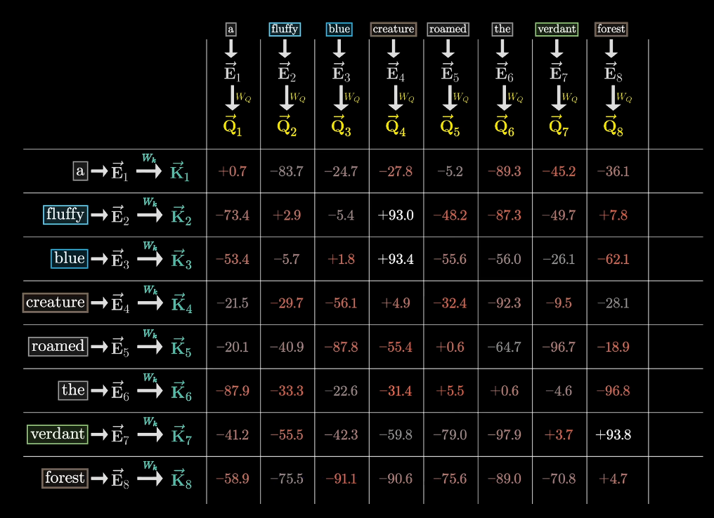
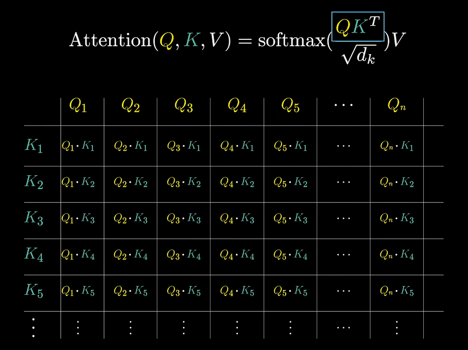
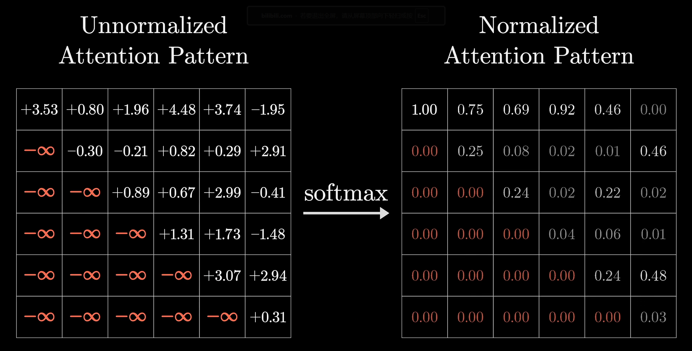
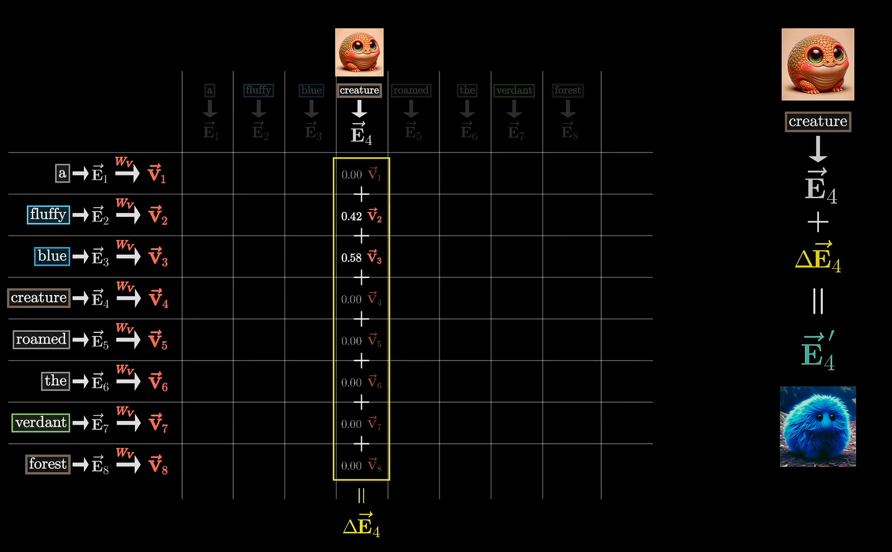
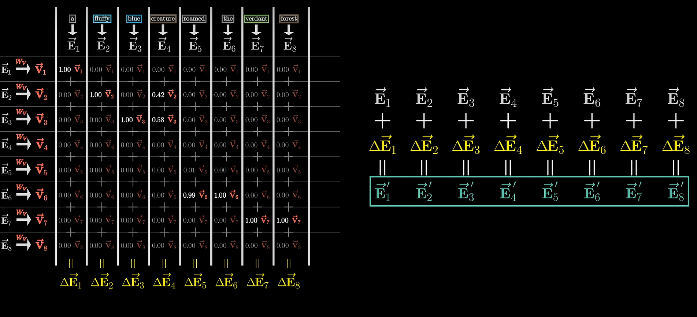
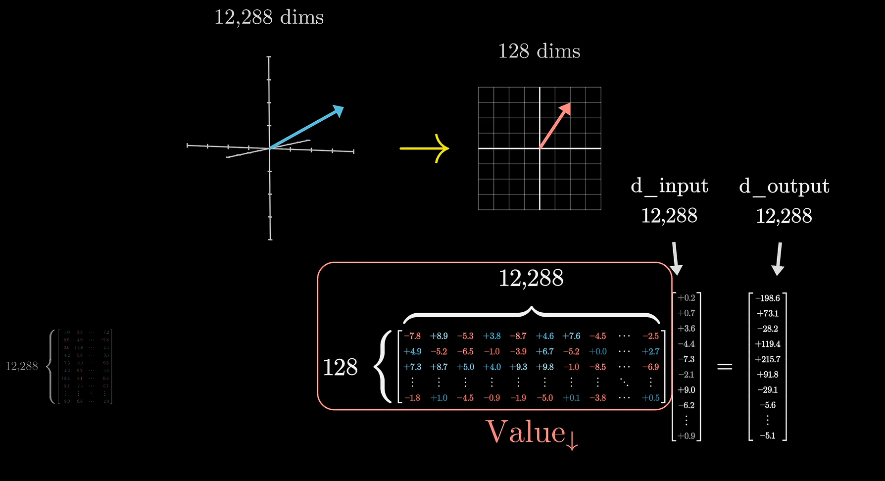
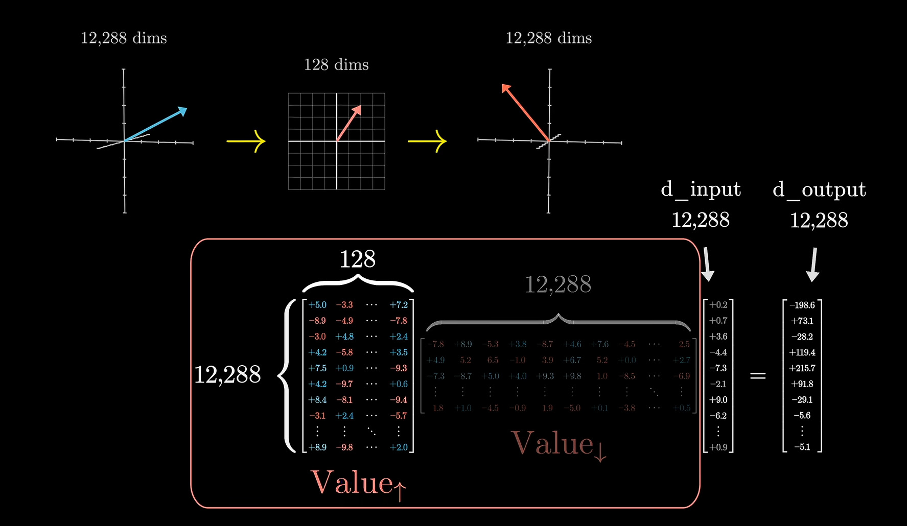
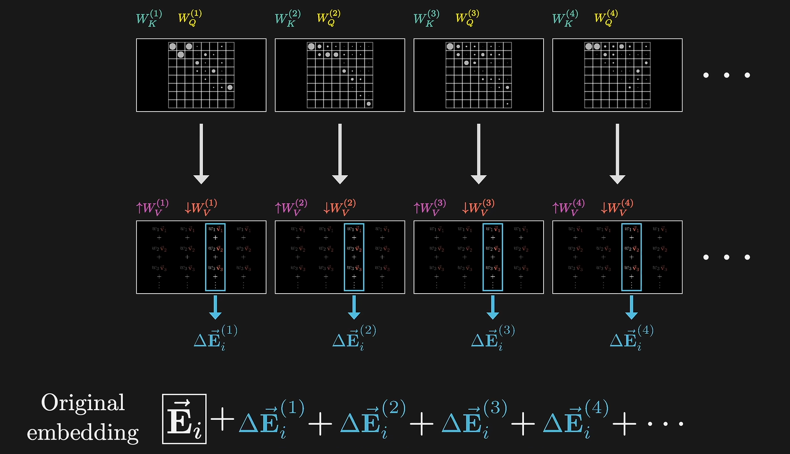

# 说在前面
&emsp;这个帖子其实很早就开始写了，但是一直没填这个坑(~~不是因为懒~~)，现在发现以前主流的卷积模型现在都不咋用了，从注意力机制提以来，几乎全是注意力机制下的深度学习模型，事实证明，这个思想确实没错，现在AI水平用的大多也都是这个，效果也不错，阻碍模型发展一是数据，二是算力，算法可能还有改进空间，但是整个框架是正确的，至少在下一种算法提出来之前，注意力更符合人的思考方式。特此，写一篇关于Transform的学习笔记，一是自己使用，二是也希望能或多或少帮助别人。
## 原理

$W_k$是键矩阵 $W_Q$是询问矩阵

$QK^T$底部的$\sqrt{d_k}$表示向量距离原点的距离，相除保证数值稳定

V的计算方法

单头注意力机制的计算

