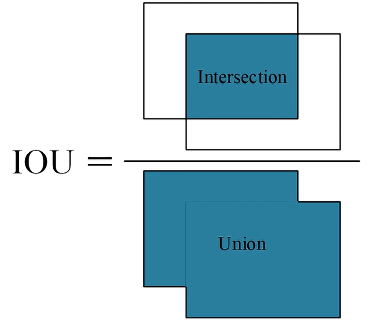

## 什么情况要用Yolo
&emsp;首先我们思考一下Yolo的使用场景以及在此场景下要如何实现目标识别的功能。我们知道Yolo的输出结果是一个锚框和锚框框住的物品和其分类概率，那么我们输出的结果应该至少应该包含以下六条信息
- x-对应物品所在区域中心点的x坐标
- y-对应物品所在区域中心点的y坐标
- h-在图片上绘制的锚框高度
- w-在图片上绘制的锚框宽度
- c-锚框中的物体的分类
- p-目标为c的概率
那我们如何做到这一点？首先我们来讨论结果中最容易完成的功能-分类。
## 由Yolo结果来逆推模型思路
&emsp;现在我们假定锚框已经绘制，我们需要做的就是对锚框内的物体进行识别，然后给出目标的分类概率，所以我们可以考虑一个最简单的模型，AlexNet或者RestNet。事实上YoloV1本质上也是一个全卷积网络，只是在检测头上进行了创新，使其能输出(x,y,w,h,c,p)。通过卷积提取特征，然后进行反复卷积，并配合残差，我们很容易能实现分类，具体可以查看我之前写过的几篇post。
&emsp;分类问题好解决，接下来就是解决位置的问题，我们怎么确定目标位置？我们首先可以讲图片进行n\*n的分割，注意n\*n可以不是均匀分割，是模型根据图片中的内容进行分割，但是为了方便理解，论文中用均匀分割进行示意。下图为分割示意图：

&emsp;在此图中，我们将图片分割为了7\*7的均匀区域，每个区域会生成两个锚框对框中的物体进行识别，并输出(x,y,w,h,c,p)。同时，由于输入图片大小不一定为448\*448，我们x，y，w，h应该为归一化后的值，取相对位置来输出结果。如此一来，整个图片中的物体识别工作我们就大致完成了。
## 如何使模型输出正确结果
&emsp;我们知道，任何模型的设计都是为了去解决一类问题，而不是针对某个具体问题编写具体代码，最多是根据实际情况对模型参数进行微调。那么在不同场景下我们怎么对模型参数进行自动调整，这就需要我们使用损失函数来让输出结果逼近真实值(在目标检测领域就是将锚框尽量框住模型，并且能较大概率识别出正确的目标)。在数据拟合中，我们可以通过减少真实值和预测值之间的大小来提高模型精度，但在目标检测中，我们使用IOU(交并比)来实现这一功能。计算方法如下图所示：

&emsp;通过比较人工标记的锚框和模型预测的锚框的交集和并集的比值来计算损失函数。最常见的几个指标值mAP50和mAP75，分别表示所有预测的锚框中，交并比超过50/75，占锚框总个数的多少。有了这么多检测框，那自然需要设置一个阈值，来挑选最合适的检查框进行显示，这个阈值一般是人为设定。
&emsp;接下来我们考虑概率该如何计算。首先，我们要考虑框中有没有物体，有则为1，无则为0，随后考虑物体种类的预测概率和交并比的乘积，随后计算出概率的置信度。