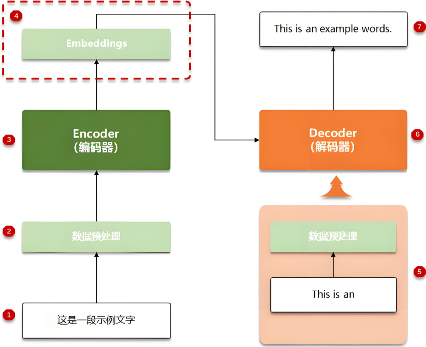

# 引言
&emsp;多模态融合要解决两方面的问题，一是数据对齐，二是数据融合。现有的多模态融合模型有:MLLMs(multimodal large language models)、Kosmos-2、ContextDET
## 数据对齐(Alignment)
&emsp;以不同的传感器为例，不同的传感器产生的数据，在大小上不完全相等，有时会存在某个数据过大或者某个数据过小，这时候我们需要将数据进行归一化，我们可以理解为狭义上的数据对齐。广义上的数据对齐是指，建立跨模态的语义对应关系，使表征共享同一空间(occupy a shared space)。
## 数据融合(Fusion) 
&emsp;在对数据进行对齐后，将这些特征合并成统一的预测结果或嵌入表示。
## 多模态损失函数
&emsp;在完成数据的对齐和融合后，将语义相似的对(如图-文)放在一起，构成向量对，基于向量对，有以下四种损失函数的计算方法
1. Contrastive Loss
$$
\mathcal{L}_{\text {contrastive }}=(1-y) \cdot d^{2}+y \cdot \max (0, m-d)^{2}
$$
&emsp;其中$d$表示嵌入(Embedding)后两个向量对的距离，$y=1$表示两个向量对无关，$m$是向量对距边缘距离(？)
2. Sigmoid Loss

3. Cross-Entropy Loss
4. Reconstruction Loss
## 多模态数据集
*见综述表一
## 多模态融合目标
1. 使不同的数据可以相辅相成，提高特点模型的精确度和有效性
2. 解决数据的局限性和稀缺性
## 补充知识
### 嵌入(Embedding)
&emsp;简单来说，这就是一种映射关系，就是将非数值数据转换为神经网络能够处理的格式，同时处理后的数据格式能被模型还原输出。其示意图如下图所示：

